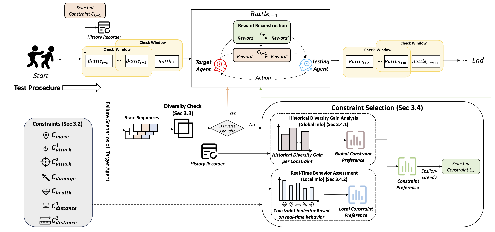
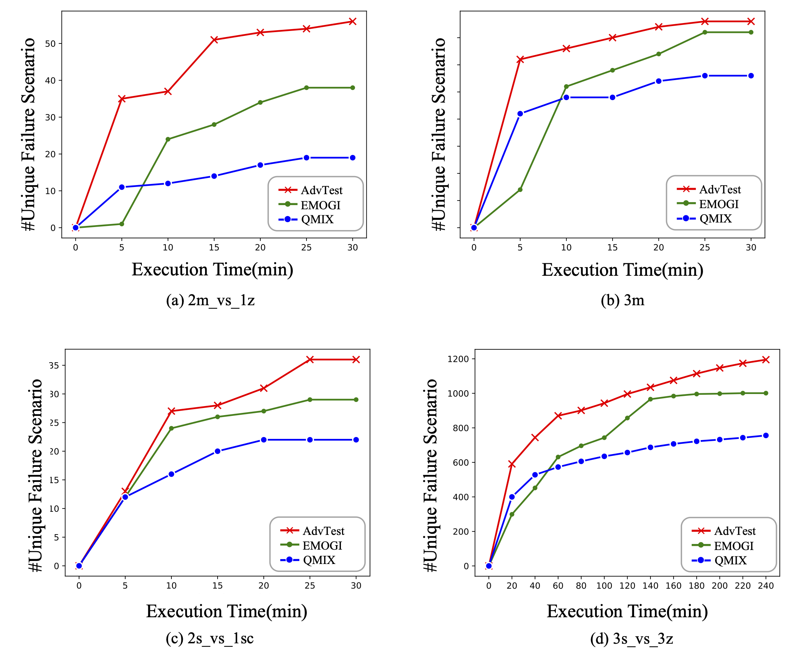

# <font size=6>AdvTest</font>
This repository contains data and code for the paper Diversity-Oriented Testing for Competitive Games via Constraint-Guided Adversarial Agent Training.

# Overview

We propose a novel diversity-oriented testing framework (called AdvTest) for adversarial agent with constraint-guided adversarial agent training.

We make experimental evaluation of effectiveness of AdvTest on four maps in StarCraft II with promising performance, outperforming the SOTA baseline.

The overall structure is shown in the figure below:


# Environment Setup
## Installation instructions

Install Python packages

```shell
# require Anaconda 3 or Miniconda 3
conda create -n pymarl python=3.8 -y
conda activate pymarl

bash install_dependecies.sh
```

Set up StarCraft II (2.4.10) and SMAC:

```shell
bash install_sc2.sh
```

This will download SC2.4.10 into the 3rdparty folder and copy the maps necessary to run over.


## Command Line Tool

**Run an experiment**

```shell
# For SMAC
python3 src/main.py --config=qmix --env-config=sc2 with env_args.map_name=2m_vs_1z
```

The config files act as defaults for an algorithm or environment.

They are all located in `src/config`.
`--config` refers to the config files in `src/config/algs`
`--env-config` refers to the config files in `src/config/envs`


# Trend Graph Results
The trend of Unique Failure Scenarios found by AdvTest and baselines(QMIX and EMOGI):



# Reference
- https://github.com/oxwhirl/smac
- https://github.com/hijkzzz/pymarl2/
- https://github.com/NeteaseFuxiRL/wuji